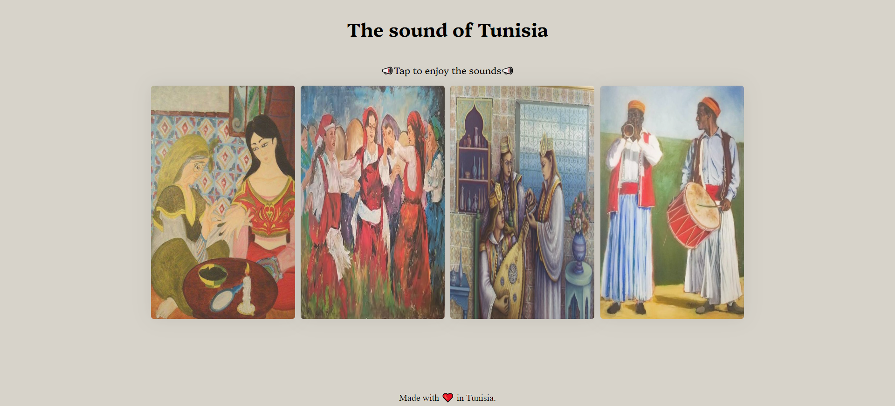

## Tunisian Sounds - Static Webpage
### Overview
This static webpage showcases four pieces of Tunisian music, designed to demonstrate the implementation of audio playback using JavaScript.
### Features
-   Simple and clean design.
-   Layout using Flexbox for efficient design and alignment.
-   Sound Implementation
### Technologies Used
-   HTML
-   CSS
-   JavaScript

(Note: This project does not utilize Bootstrap.)

### Preview 

Feel free to customize the sections and content to better fit your project!